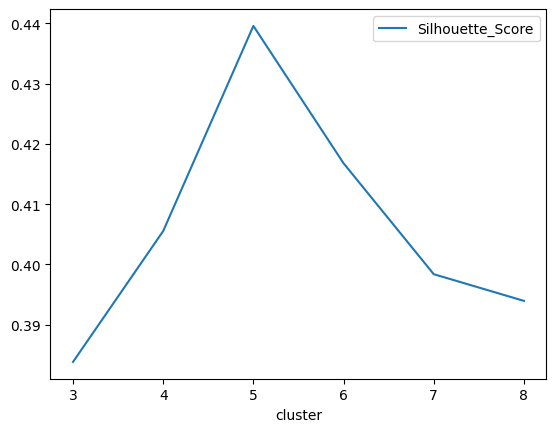

Clustering Customers 
==============================

An app has been built using Streamlit and deployed with Streamlit community cloud

[Visit the app here](https://clusteranalysis-n9lzcudmv8d8ebjwscehkz.streamlit.app/)

This project predicts which cluter out 5 main clusters a customer belongs to based on his/her age, gender, annual income, and spending score.

## Features
- User-friendly interface powered by Streamlit.
- Input form to enter details such as gender, age, annual income, and spending score.
- Real-time prediction of lcluster.
- Accessible via Streamlit Community Cloud

## Dataset
The application is trained on the **mall_customer**, which widely used for unsupervised learning problems. The dataset contains the following features:
- Age
- Gender
- Spending score
- Annual income

## Technologies Used
- **Streamlit**: For building the web application.
- **Scikit-learn**: For model training and evaluation.
- **Pandas** and **NumPy**: For data preprocessing and manipulation.
- **Matplotlib** and **Seaborn**: For exploratory data analysis and visualization (if applicable).
Project Organization

## Model
The predictive model is trained using the mall customers dataset. As this is **customer segmentation** problem, the model is a clustering algorithm. 

### Number of Clusters

Through EDA, the optimal number of clusters is determined to be 5 by calculating the silhouette score when all features are included as seen below



## Installation (for local deployment)
If you want to run the application locally, follow these steps:

1. Clone the repository:
   ```bash
   git clone https://github.com/noob-noob1/Cluster_Analysis.git

2. Create and activate a virtual environment:
   ```bash
   python -m venv env
   source env/bin/activate  # On Windows, use `env\\Scripts\\activate`

3. Install dependencies:
   ```bash
   pip install -r requirements.txt

4. Run the Streamlit application:
   ```bash
   streamlit run streamlit.py

## Future enhancement

Adding an LLM through an API so give discriptions about the clusters, and adding it to the app would enhance this project. This would be my next modification.

------------

    ├── LICENSE
    ├── Makefile           <- Makefile with commands like `make data` or `make train`
    ├── README.md          <- The top-level README for developers using this project.
    ├── data
    │   ├── external       <- Data from third party sources.
    │   ├── interim        <- Intermediate data that has been transformed.
    │   ├── processed      <- The final, canonical data sets for modeling.
    │   └── raw            <- The original, immutable data dump.
    │
    ├── docs               <- A default Sphinx project; see sphinx-doc.org for details
    │
    ├── models             <- Trained and serialized models, model predictions, or model summaries
    │
    ├── notebooks          <- Jupyter notebooks. Naming convention is a number (for ordering),
    │                         the creator's initials, and a short `-` delimited description, e.g.
    │                         `1.0-jqp-initial-data-exploration`.
    │
    ├── references         <- Data dictionaries, manuals, and all other explanatory materials.
    │
    ├── reports            <- Generated analysis as HTML, PDF, LaTeX, etc.
    │   └── figures        <- Generated graphics and figures to be used in reporting
    │
    ├── requirements.txt   <- The requirements file for reproducing the analysis environment, e.g.
    │                         generated with `pip freeze > requirements.txt`
    │
    ├── setup.py           <- makes project pip installable (pip install -e .) so src can be imported
    ├── src                <- Source code for use in this project.
    │   ├── __init__.py    <- Makes src a Python module
    │   │
    │   ├── data           <- Scripts to download or generate data
    │   │   └── make_dataset.py
    │   │
    │   ├── features       <- Scripts to turn raw data into features for modeling
    │   │   └── build_features.py
    │   │
    │   ├── models         <- Scripts to train models and then use trained models to make
    │   │   │                 predictions
    │   │   ├── predict_model.py
    │   │   └── train_model.py
    │   │
    │   └── visualization  <- Scripts to create exploratory and results oriented visualizations
    │       └── visualize.py
    │
    └── tox.ini            <- tox file with settings for running tox; see tox.readthedocs.io


--------

<p><small>Project based on the <a target="_blank" href="https://drivendata.github.io/cookiecutter-data-science/">cookiecutter data science project template</a>. #cookiecutterdatascience</small></p>
